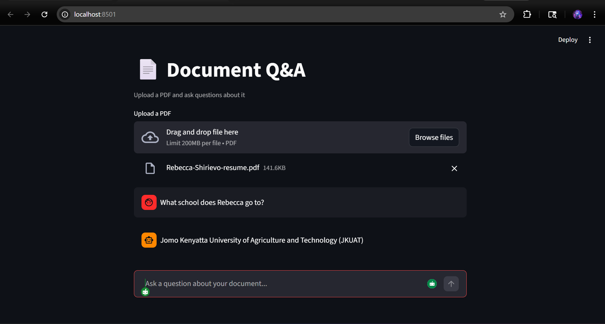

# Document Q&A — RAG Pipeline

A Retrieval Augmented Generation (RAG) pipeline that lets you upload any PDF and ask questions about it in natural language. Powered by Groq (LLaMA 3.3), LangChain, and ChromaDB — with a clean Streamlit chat interface.



## What is RAG?

Large language models are powerful but they don't know the contents of your specific documents. RAG solves this by:

1. **Retrieving** the most relevant sections of your document for a given question
2. **Augmenting** the prompt with that context
3. **Generating** an accurate, grounded answer

The result is a system that answers questions about your documents without hallucinating — because it only uses what's actually in the text.

## How it works

```
PDF Upload
    └── Load & chunk document (500 char chunks, 50 char overlap)
            └── Embed chunks (HuggingFace all-MiniLM-L6-v2)
                    └── Store in ChromaDB (local vector database)
                            └── User asks a question
                                    └── Retrieve top 3 relevant chunks
                                            └── Pass to Groq LLaMA 3.3
                                                    └── Return grounded answer
```

## Features

- Upload any PDF and ask questions about it
- Chat interface with full conversation history
- Answers grounded strictly in the document — won't make things up
- Fast retrieval with ChromaDB vector search
- Free to run — uses Groq's free API tier and a local HuggingFace embedding model
- New document uploads automatically clear and reindex

## Setup

### 1. Clone the repository

```bash
git clone https://github.com/cyb3rr31a/rag-pipeline.git
cd rag-pipeline
```

### 2. Create a virtual environment

```bash
python3 -m venv rag-env
source rag-env/bin/activate
```

### 3. Install dependencies

```bash
pip install -r requirements.txt
```

### 4. Get a free Groq API key

Sign up at [console.groq.com](https://console.groq.com) — no credit card required.

### 5. Create your `.env` file

```bash
cp .env.example .env
```

Add your Groq API key:

```
GROQ_API_KEY=your_groq_api_key_here
```

### 6. Run the app

```bash
streamlit run app.py
```

Opens at `http://localhost:8501`. Upload a PDF and start asking questions.

---

You can also run it as a CLI:

```bash
python3 rag.py
```

## Project structure

```
rag-pipeline/
├── app.py               # Streamlit web interface
├── rag.py               # CLI version with interactive prompt
├── chroma_db/           # Local vector database (not tracked by Git)
├── .env                 # Your Groq API key (not tracked by Git)
├── .env.example         # Template for .env
├── .gitignore           # Ignores .env, chroma_db, venv
├── requirements.txt     # Python dependencies
└── README.md            # This file
```

## Dependencies

- `langchain` — RAG pipeline orchestration
- `langchain-groq` — Groq LLM integration
- `langchain-huggingface` — HuggingFace embeddings
- `chromadb` — local vector database
- `streamlit` — web interface
- `pypdf` — PDF loading
- `python-dotenv` — environment variable management

## Stack

| Component | Tool |
|---|---|
| LLM | Groq — LLaMA 3.3 70B |
| Embeddings | HuggingFace — all-MiniLM-L6-v2 |
| Vector store | ChromaDB |
| Orchestration | LangChain LCEL |
| Interface | Streamlit |